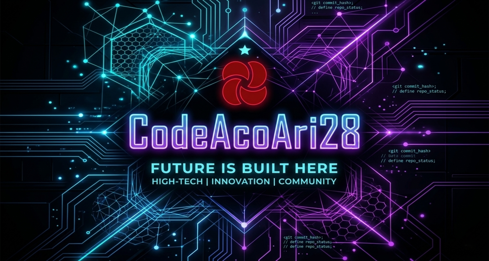

# 
¡Hola, soy ChimaloCode! 👋

  

  

---

### ⚡ Sobre Mí

Soy un **estudiante de Ingeniería en Sistemas** y **Desarrollador Full Stack** impulsado por la intersección entre la innovación y la lógica. Como cofundador de **[DerejSoft](https://derejsoft.com/)**, diseño soluciones que cierran la brecha entre la complejidad técnica y la experiencia del usuario.

- 🔭 **Enfoque Actual:** Sistemas Backend Avanzados y Ciberseguridad.
- 🚀 **Misión:** Desarrollar ecosistemas digitales robustos, escalables y seguros.
- 📍 **Ubicado en:** Santiago, República Dominicana.

---

### 🛠️ Stack Tecnológico y Herramientas

| **Categoría** | **Tecnologías** |
| :--- | :--- |
| **Backend y Lógica** |   |
| **Arte en el Frontend** |    |
| **Infraestructura y Ops** |    |
| **Herramientas y SO** |   |

---

### 📊 Analíticas de GitHub

  
  

  

---

### 🔗 Conéctate Conmigo

  
  

  

